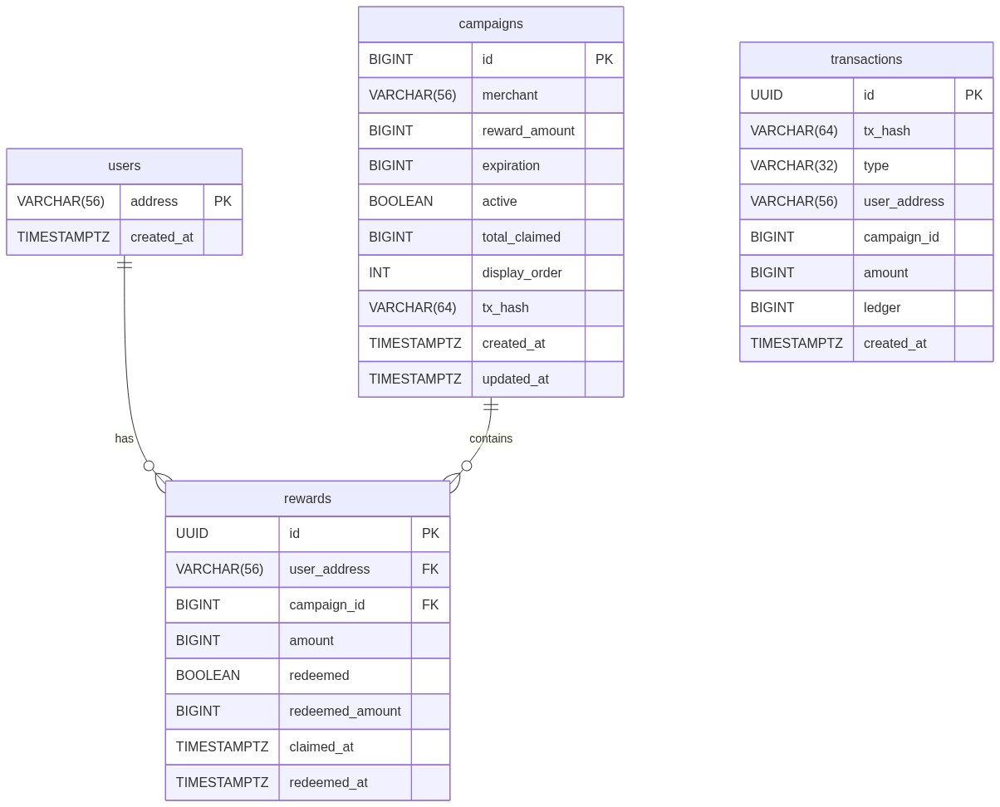

# Database Schema Documentation

This document describes the PostgreSQL database schema for the SorobanLoyalty platform.

## Entity Relationship Diagram

## Tables

### `users`
**Purpose**: Tracks unique user addresses that have interacted with the platform.
- `address` (VARCHAR(56), PK): The Stellar public key (G...) of the user.
- `created_at` (TIMESTAMPTZ): Timestamp when the user was first recorded.

### `campaigns`
**Purpose**: Stores loyalty campaigns created by merchants.
- `id` (BIGINT, PK): The unique ID of the campaign, derived from the Soroban contract.
- `merchant` (VARCHAR(56)): The Stellar address of the merchant who created the campaign.
- `reward_amount` (BIGINT): The total amount of LYT tokens available in this campaign.
- `expiration` (BIGINT): Unix timestamp when the campaign expires.
- `active` (BOOLEAN): Whether the campaign is currently active.
- `total_claimed` (BIGINT): Running total of how many LYT tokens have been claimed.
- `display_order` (INT): Used for frontend sorting/display priority.
- `tx_hash` (VARCHAR(64)): The hash of the transaction that created the campaign.
- `created_at` (TIMESTAMPTZ): Timestamp of creation in the database.
- `updated_at` (TIMESTAMPTZ): Timestamp of the last update.

### `rewards`
**Purpose**: Maps users to the rewards they have claimed from specific campaigns.
- `id` (UUID, PK): Internal unique identifier.
- `user_address` (VARCHAR(56), FK): Reference to the `users` table.
- `campaign_id` (BIGINT, FK): Reference to the `campaigns` table.
- `amount` (BIGINT): The amount of LYT tokens claimed.
- `redeemed` (BOOLEAN): Whether the user has redeemed this reward.
- `redeemed_amount` (BIGINT): The amount of the reward that has been redeemed.
- `claimed_at` (TIMESTAMPTZ): Timestamp when the reward was claimed.
- `redeemed_at` (TIMESTAMPTZ): Timestamp when the reward was redeemed.

### `transactions`
**Purpose**: An append-only ledger of on-chain events processed by the indexer.
- `id` (UUID, PK): Internal unique identifier.
- `tx_hash` (VARCHAR(64), UNIQUE): The transaction hash on the Stellar network.
- `type` (VARCHAR(32)): The type of transaction ('claim', 'redeem', 'transfer', etc).
- `user_address` (VARCHAR(56)): The user involved in the transaction (nullable).
- `campaign_id` (BIGINT): The campaign involved (nullable).
- `amount` (BIGINT): The token amount involved (nullable).
- `ledger` (BIGINT): The Stellar network ledger sequence number.
- `created_at` (TIMESTAMPTZ): When the transaction was indexed.

## Foreign Key Relationships
1. **`rewards.user_address` -> `users.address`**: Ensures that a reward is always tied to a known user. `ON DELETE CASCADE` ensures that if a user is deleted, their reward history is also removed (though users are typically not deleted in this append-only system).
2. **`rewards.campaign_id` -> `campaigns.id`**: Ensures that a reward belongs to a valid campaign. `ON DELETE CASCADE` cleans up rewards if a campaign is deleted.

**Note on Constraints**: `rewards` has a `UNIQUE (user_address, campaign_id)` constraint to enforce the rule that a user can only claim from a campaign once.

## Index Rationale
- `idx_rewards_user` (on `rewards.user_address`): Optimizes the query to fetch all rewards for a specific user (e.g., loading the user's dashboard).
- `idx_rewards_campaign` (on `rewards.campaign_id`): Optimizes queries aggregating metrics for a specific campaign (e.g., merchant analytics dashboard).
- `idx_transactions_user` (on `transactions.user_address`): Accelerates fetching the transaction history for a specific user.
- `idx_campaigns_merchant` (on `campaigns.merchant`): Optimizes fetching all campaigns created by a specific merchant.
