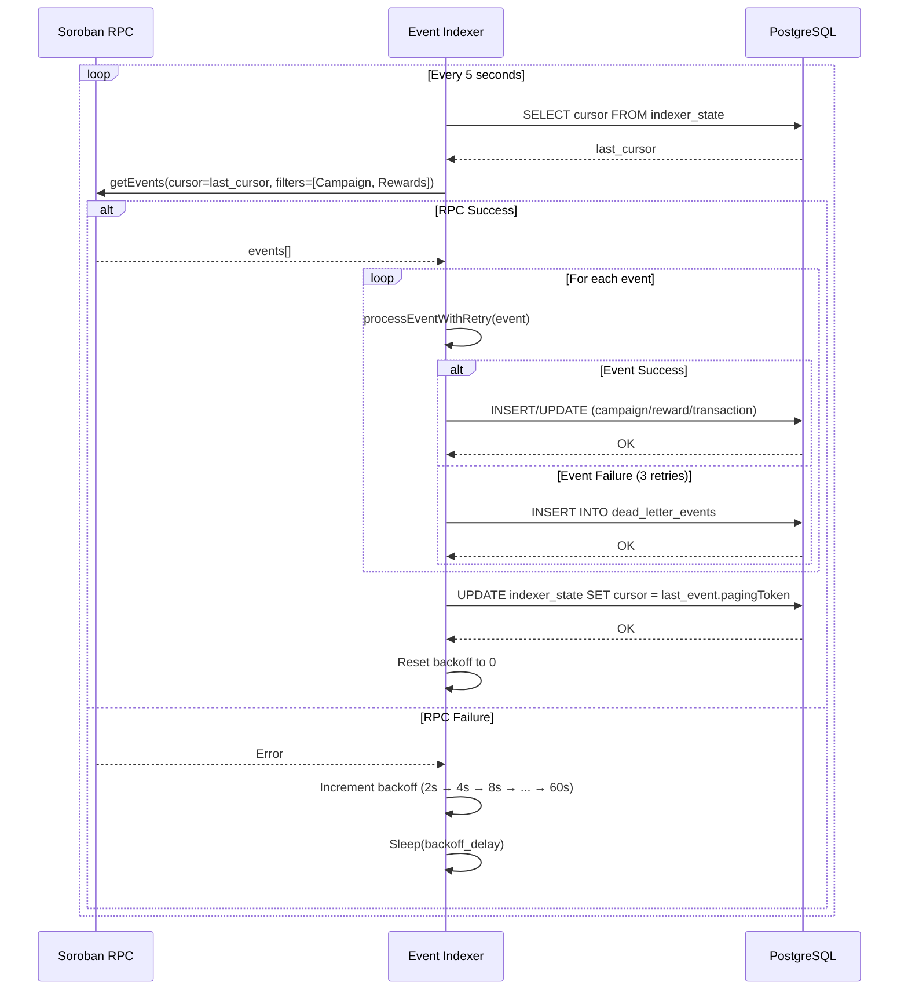

# Event Indexer Documentation

## Overview

The event indexer is a background service that polls the Soroban RPC for contract events and persists them to the PostgreSQL database. It bridges on-chain activity with the off-chain database, enabling the backend API to serve campaign and reward data without querying the blockchain directly.

## Architecture

```
┌─────────────────────────────────────────────────────────────┐
│                    Soroban RPC (Stellar)                    │
│  ┌──────────────────┐       ┌──────────────────┐           │
│  │ Campaign Contract│       │ Rewards Contract │           │
│  │  CAM_CRT         │       │  RWD_CLM         │           │
│  │  CAM_DEACT       │       │  RWD_RDM         │           │
│  └──────────────────┘       └──────────────────┘           │
└─────────────────────────────────────────────────────────────┘
                        │
                        │ getEvents() polling
                        ▼
┌─────────────────────────────────────────────────────────────┐
│                      Event Indexer                          │
│  ┌──────────────────────────────────────────────────────┐   │
│  │ Poll Loop (5s interval)                              │   │
│  │  - Fetch events from last cursor                     │   │
│  │  - Process each event with retry (max 3 attempts)    │   │
│  │  - Update cursor after batch                         │   │
│  │  - Exponential backoff on RPC failure                │   │
│  └──────────────────────────────────────────────────────┘   │
└─────────────────────────────────────────────────────────────┘
                        │
                        │ INSERT/UPDATE
                        ▼
┌─────────────────────────────────────────────────────────────┐
│                      PostgreSQL                             │
│  ┌──────────────┐  ┌──────────────┐  ┌──────────────────┐  │
│  │  campaigns   │  │   rewards    │  │  transactions    │  │
│  │  users       │  │ indexer_state│  │ dead_letter_events│ │
│  └──────────────┘  └──────────────┘  └──────────────────┘  │
└─────────────────────────────────────────────────────────────┘
```

## Polling Mechanism

### Interval and Cursor Tracking

- **Base interval**: 5 seconds (configurable via `POLL_INTERVAL_MS`)
- **Cursor persistence**: The indexer stores the last processed `pagingToken` in the `indexer_state` table
- **Restart behavior**: On restart, the indexer resumes from the last saved cursor, preventing re-processing and gaps

### Exponential Backoff

When the RPC is unreachable or returns errors, the indexer applies exponential backoff:

- **Base delay**: 2 seconds
- **Multiplier**: 2x per consecutive failure
- **Max delay**: 60 seconds
- **Jitter**: ±20% random variation to avoid thundering herd

Formula:
```
delay = min(BACKOFF_BASE_MS * (BACKOFF_MULTIPLIER ^ failures), BACKOFF_MAX_MS) * (1 ± JITTER_FACTOR)
```

After a successful poll, the backoff resets to 0.

## Processed Event Types

The indexer listens to events from two contracts:

### Campaign Contract Events

| Event | Topics | Value | Database Effect |
|---|---|---|---|
| `CAM_CRT` | `[CAM_CRT, "id", campaign_id]` | `merchant_address` | `INSERT INTO campaigns` (id, merchant, active=true, tx_hash) |
| `CAM_DEACT` | `[CAM_DEACT, "id", campaign_id]` | `merchant_address` | `UPDATE campaigns SET active=false WHERE id=campaign_id` |

### Token Contract Events

| Event | Topics | Value | Database Effect |
|---|---|---|---|
| `MINT` | `[MINT, "to", to_address]` | `(amount, total_supply)` | `INSERT INTO transactions` (type='mint', user_address=to, amount, ledger) |
| `BURN` | `[BURN, "from", from_address]` | `(amount, total_supply)` | `INSERT INTO transactions` (type='burn', user_address=from, amount, ledger) |

### Rewards Contract Events

| Event | Topics | Value | Database Effect |
|---|---|---|---|
| `RWD_CLM` | `[RWD_CLM, "user", user_address]` | `(campaign_id, amount)` | `INSERT INTO rewards` (user_address, campaign_id, amount, redeemed=false)<br>`INSERT INTO transactions` (type='claim') |
| `RWD_RDM` | `[RWD_RDM, "user", user_address]` | `amount` | `INSERT INTO transactions` (type='redeem', user_address, amount, ledger) |

## Failure Handling

### Per-Event Retry

Each event is processed with up to **3 retry attempts** (configurable via `MAX_EVENT_RETRIES`). If an event fails after all retries, it is **dead-lettered** and processing continues with the next event.

### Dead-Letter Queue

Failed events are written to the `dead_letter_events` table:

```sql
CREATE TABLE dead_letter_events (
  tx_hash      VARCHAR(128) PRIMARY KEY,
  contract_id  VARCHAR(128),
  paging_token TEXT,
  payload      JSONB,
  error        TEXT,
  created_at   TIMESTAMPTZ NOT NULL DEFAULT NOW()
)
```

Dead-lettered events can be inspected and replayed manually.

### Idempotency

All database operations use `INSERT ... ON CONFLICT DO UPDATE` or `ON CONFLICT DO NOTHING` to ensure idempotency. Re-processing the same event (e.g., after a crash mid-batch) will not create duplicates.

## Monitoring

### Health Check

The indexer exposes a health endpoint via the backend API:

```
GET /health
```

Response includes:
- Indexer status (running/stopped)
- Last processed ledger
- Indexer lag (blocks behind chain tip)

### Metrics (Prometheus)

| Metric | Type | Description |
|---|---|---|
| `indexer_events_total` | Counter | Total events processed |
| `indexer_poll_errors` | Counter | Total RPC poll failures |
| `indexer_dead_letters` | Counter | Total dead-lettered events |
| `indexer_lag_blocks` | Gauge | Blocks behind chain tip |
| `indexer_backoff_ms` | Gauge | Current backoff delay (0 = healthy) |

### Checking Indexer Lag

```bash
# Query Prometheus
curl http://localhost:9090/api/v1/query?query=indexer_lag_blocks

# Query database
SELECT value FROM indexer_state WHERE key = 'cursor';
```

If lag is growing, check:
1. RPC availability (`indexer_poll_errors`)
2. Dead-letter count (`indexer_dead_letters`)
3. Database performance (slow queries)

## Replaying Events

### From a Specific Ledger

To replay events from ledger `N`:

1. Stop the indexer:
   ```bash
   docker-compose stop backend
   ```

2. Update the cursor:
   ```sql
   UPDATE indexer_state SET value = 'LEDGER_N_CURSOR' WHERE key = 'cursor';
   -- Or delete to start from ledger 1:
   DELETE FROM indexer_state WHERE key = 'cursor';
   ```

3. Restart the indexer:
   ```bash
   docker-compose start backend
   ```

### Replaying Dead-Lettered Events

1. Inspect failed events:
   ```sql
   SELECT * FROM dead_letter_events ORDER BY created_at DESC;
   ```

2. Fix the root cause (e.g., schema mismatch, contract address typo)

3. Delete the dead-letter entry:
   ```sql
   DELETE FROM dead_letter_events WHERE tx_hash = 'FAILED_TX_HASH';
   ```

4. Reset the cursor to before the failed event and restart the indexer

## Sequence Diagram



## Configuration

Environment variables (`.env`):

```bash
# Contract addresses to index
CAMPAIGN_CONTRACT_ID=CXXXXXXXXXXXXXXXXXXXXXXXXXXXXXXXXXXXXXXXXXXXXXXXXXXXXXXX
REWARDS_CONTRACT_ID=CXXXXXXXXXXXXXXXXXXXXXXXXXXXXXXXXXXXXXXXXXXXXXXXXXXXXXXX
TOKEN_CONTRACT_ID=CXXXXXXXXXXXXXXXXXXXXXXXXXXXXXXXXXXXXXXXXXXXXXXXXXXXXXXX

# RPC endpoint
SOROBAN_RPC_URL=https://soroban-testnet.stellar.org

# Polling interval (milliseconds)
POLL_INTERVAL_MS=5000

# Backoff configuration
BACKOFF_BASE_MS=2000
BACKOFF_MAX_MS=60000
MAX_EVENT_RETRIES=3
```

## Troubleshooting

### Indexer is not processing events

1. Check RPC connectivity:
   ```bash
   curl -X POST $SOROBAN_RPC_URL \
     -H "Content-Type: application/json" \
     -d '{"jsonrpc":"2.0","id":1,"method":"getHealth"}'
   ```

2. Check indexer logs:
   ```bash
   docker-compose logs backend | grep indexer
   ```

3. Check `indexer_poll_errors` metric

### Indexer lag is growing

1. Check RPC rate limits (429 errors in logs)
2. Check database query performance:
   ```sql
   SELECT * FROM pg_stat_statements ORDER BY total_exec_time DESC LIMIT 10;
   ```
3. Increase `POLL_INTERVAL_MS` to reduce RPC load

### Events are being dead-lettered

1. Inspect the error message:
   ```sql
   SELECT tx_hash, error, payload FROM dead_letter_events ORDER BY created_at DESC LIMIT 10;
   ```

2. Common causes:
   - XDR decoding failure (contract schema changed)
   - Foreign key violation (campaign not yet indexed)
   - Database constraint violation (duplicate key)

3. Fix the root cause and replay from before the failed event

## Development

### Running Tests

```bash
cd backend
npm test src/__tests__/indexer.test.ts
```

### Manual Event Injection

For testing, you can manually insert events into the database:

```sql
INSERT INTO campaigns (id, merchant, reward_amount, expiration, active, tx_hash)
VALUES (999, 'GXXXXXXXXXXXXXXXXXXXXXXXXXXXXXXXXXXXXXXXXXXXXXXXXXXXXXXX', 100, 1735689600, true, 'test_tx_hash');
```

Then verify the indexer doesn't create duplicates on the next poll.
