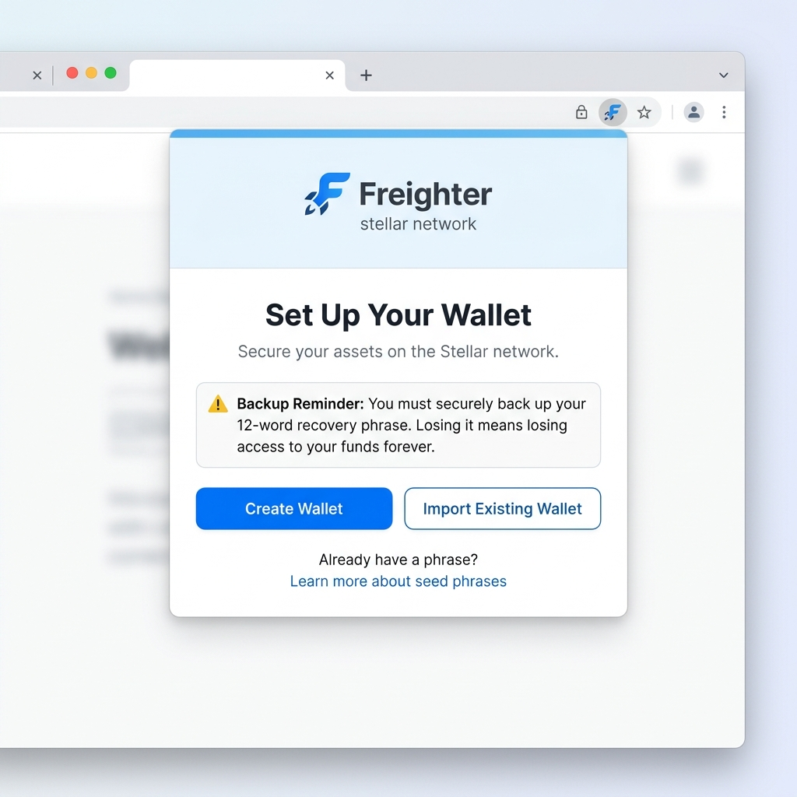
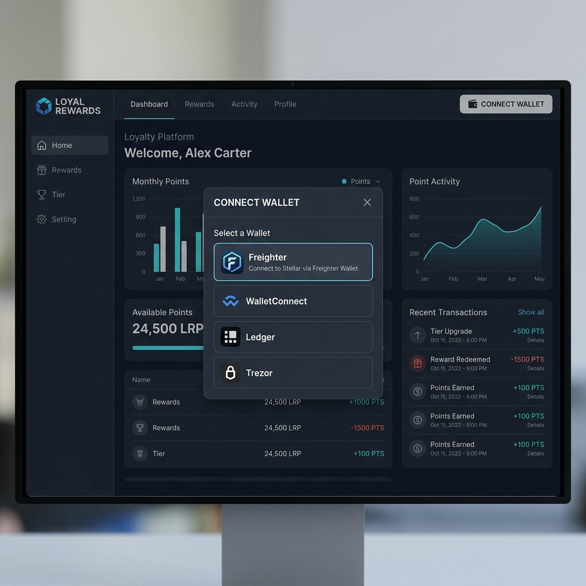
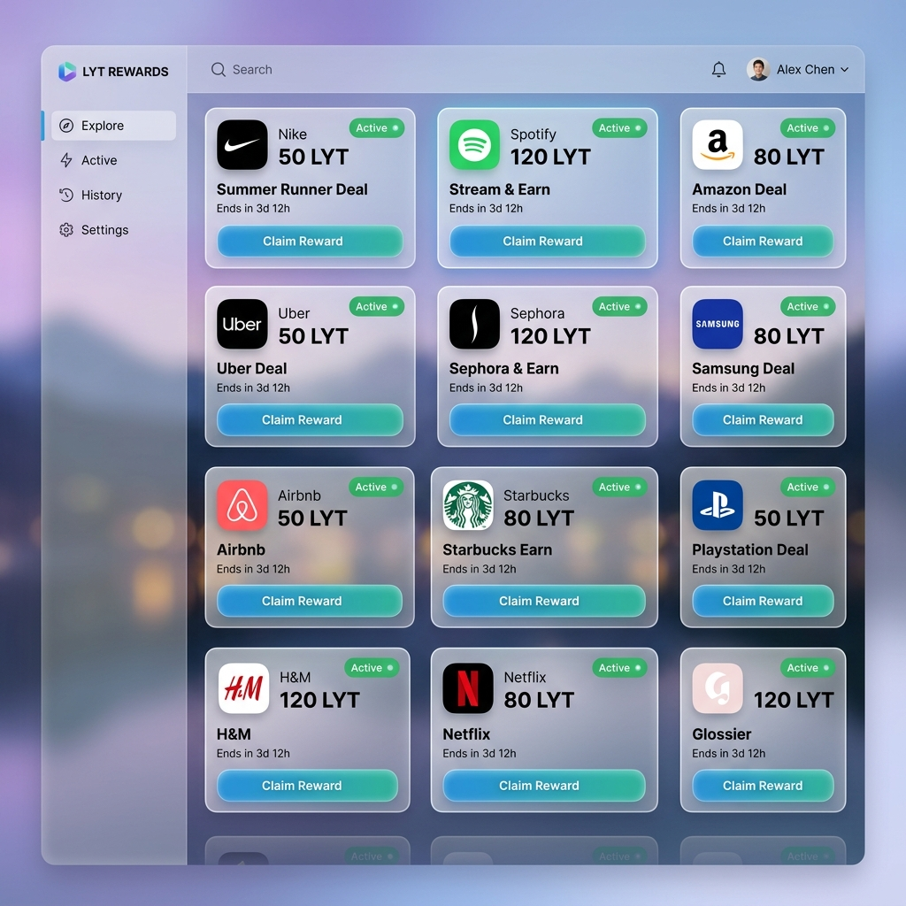

# User Guide

Welcome to the SorobanLoyalty platform! This guide will help you get started with earning and redeeming rewards on the Stellar network.

## 1. Setting Up Your Wallet

To interact with the platform, you'll need the **Freighter** wallet extension.

1.  Download and install the [Freighter extension](https://www.freighter.app/).
2.  Follow the prompts to create a new wallet.
3.  **IMPORTANT:** Securely back up your 12-word recovery phrase. If you lose this, you lose access to your funds forever.

## 2. Connecting Your Wallet

Once your wallet is set up, you can connect it to the SorobanLoyalty platform.

1.  Navigate to the [Dashboard](http://localhost:3000/dashboard).
2.  Click the **Connect Wallet** button in the top right corner.
3.  Select **Freighter** from the list of options.
4.  Approve the connection request in the Freighter popup.

## 3. Browsing and Claiming Campaigns

Merchants create campaigns that you can participate in to earn LYT tokens.

1.  Browse the available campaigns on your dashboard.
2.  Look for "Active" campaigns that interest you.
3.  Click **Claim Reward** on a campaign card.
4.  Confirm the transaction in your Freighter wallet.

## 4. Checking Your Balance

You can view your current LYT balance at any time in the dashboard sidebar or header once your wallet is connected.

## 5. Redeeming LYT Tokens

Redeeming tokens allows you to exchange your earned LYT for merchant-specific benefits or rewards.

1.  Go to the **Redeem** section of the platform.
2.  Select the amount of LYT you wish to redeem.
3.  Confirm the redemption transaction.
4.  The tokens will be burned on-chain, and your reward will be processed by the merchant.

## FAQ

**Q: Why do I need to pay a small fee to claim?**
A: Every transaction on the Stellar network requires a tiny amount of XLM (Stellar's native asset) to cover network fees.

**Q: Can I claim the same reward twice?**
A: No, our smart contracts prevent double-claiming to ensure fairness.

**Q: How long do campaigns last?**
A: Each campaign has an expiration date set by the merchant. Be sure to claim your rewards before the campaign expires!
